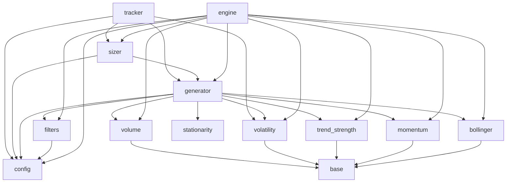

# Project Context

> **Auto-generated by [code-mapper](https://github.com/your-org/code-mapper).**  
> Read this file instead of scanning source files — it captures the full structure at a fraction of the token cost.
> `mean_reversion` · 22 files (python×22) · 29 classes · 27 functions · ~3,745 source lines

---
## File Structure

```
mean_reversion/
└── __init__.py
├── backtest/
  └── __init__.py
  └── engine.py
└── cli.py
└── config.py
├── indicators/
  └── __init__.py
  └── base.py
  └── bollinger.py
  └── momentum.py
  └── stationarity.py
  └── trend_strength.py
  └── volatility.py
  └── volume.py
├── paper_trading/
  └── __init__.py
  └── db.py
  └── tracker.py
├── position_sizing/
  └── __init__.py
  └── sizer.py
└── run_backtest.py
├── signals/
  └── __init__.py
  └── filters.py
  └── generator.py
```

## Class Diagram

```mermaid
classDiagram
    class ADX["ADX"] {
        +name()
        +compute()
        +latest_value()
        +is_ranging()
        +is_trending()
        +__init__()
    }
    Indicator <|-- ADX : extends
    class ADXConfig["«dataclass» ADXConfig"] {
        +enabled: bool
        +period: int
        +max_adx: float
    }
    class ATR["ATR"] {
        +name()
        +compute()
        +signal_series()
        +latest_atr()
        +stop_price()
        +atr_series()
        +__init__()
    }
    Indicator <|-- ATR : extends
    class ATRStopConfig["«dataclass» ATRStopConfig"] {
        +enabled: bool
        +period: int
        +multiplier: float
        +trail: bool
    }
    class BacktestConfig["«dataclass» BacktestConfig"] {
        +initial_capital: float
        +commission_per_trade: float
        +commission_pct: float
        +slippage: float
    }
    class BacktestResult["«dataclass» BacktestResult"] {
        +ticker: str
        +equity_curve: Series
        +trades_df: DataFrame
        +metrics: Dict
    }
    class BacktestSummary["«dataclass» BacktestSummary"] {
        +results: Dict
        +portfolio_equity: Optional
        +portfolio_metrics: Optional
    }
    class BollingerBands["BollingerBands"] {
        +name()
        +compute()
        +signal_series()
        +latest_zscore()
        +is_below_lower_band()
        +is_at_or_above_mean()
        +zscore_series()
        ...
    }
    Indicator <|-- BollingerBands : extends
    class BollingerConfig["«dataclass» BollingerConfig"] {
        +period: int
        +std_dev: float
        +entry_zscore: float
        +exit_zscore: float
    }
    class Indicator["«abstract» Indicator"] {
        +compute()
        +signal_series()
        +name()
    }
    class IndicatorResult["«dataclass» IndicatorResult"] {
        +values: Series
        +raw: Optional
        +name: str
    }
    class LossGuardConfig["«dataclass» LossGuardConfig"] {
        +enabled: bool
        +max_consecutive_losses: int
        +cooloff_bars: int
    }
    class MeanReversionConfig["«dataclass» MeanReversionConfig"] {
        +bollinger: BollingerConfig
        +rsi: RSIConfig
        +adx: ADXConfig
        +atr_stop: ATRStopConfig
    }
    class MultiTimeframeConfig["«dataclass» MultiTimeframeConfig"] {
        +enabled: bool
        +fast_weeks: int
        +slow_weeks: int
    }
    class OBV["OBV"] {
        +name()
        +compute()
        +is_bullish()
        +__init__()
    }
    Indicator <|-- OBV : extends
    class PortfolioConstraintsConfig["«dataclass» PortfolioConstraintsConfig"] {
        +max_open_positions: int
        +max_sector_exposure_pct: float
        +max_gross_exposure_pct: float
        +adv_participation_pct: float
    }
    class PositionSizingConfig["«dataclass» PositionSizingConfig"] {
        +base_position_pct: float
        +max_position_pct: float
        +sentiment_agree_mult: float
        +sentiment_neutral_mult: float
    }
    class RSI["RSI"] {
        +name()
        +compute()
        +signal_series()
        +latest_value()
        +is_oversold()
        +is_overbought()
        +__init__()
    }
    Indicator <|-- RSI : extends
    class RSIConfig["«dataclass» RSIConfig"] {
        +enabled: bool
        +period: int
        +oversold: float
        +overbought: float
    }
    class ShortConfig["«dataclass» ShortConfig"] {
        +enabled: bool
        +entry_zscore: float
        +exit_zscore: float
        +partial_exit_zscore: float
    }
    class Signal["«dataclass» Signal"] {
        +ticker: str
        +date: str
        +action: Action
        +zscore: float
    }
    class SignalConfig["«dataclass» SignalConfig"] {
        +sentiment_filter_enabled: bool
        +min_sentiment_confidence: float
        +block_on_negative_sentiment: bool
        +risk_filter_enabled: bool
    }
    class StationarityConfig["«dataclass» StationarityConfig"] {
        +enabled: bool
        +lookback: int
        +pvalue_threshold: float
    }
    class VWBB["VWBB"] {
        +name()
        +compute()
        +signal_series()
        +latest_zscore()
        +is_below_lower_band()
        +is_at_or_above_mean()
        +zscore_series()
        ...
    }
    Indicator <|-- VWBB : extends
    class VolatilityRegime["VolatilityRegime"] {
        +name()
        +compute()
        +signal_series()
        +latest_multiplier()
        +__init__()
    }
    Indicator <|-- VolatilityRegime : extends
    class VolatilityRegimeConfig["«dataclass» VolatilityRegimeConfig"] {
        +enabled: bool
        +period: int
        +low_vol_threshold: float
        +high_vol_threshold: float
    }
    class VolumeConfig["«dataclass» VolumeConfig"] {
        +enabled: bool
        +period: int
        +min_ratio: float
    }
    class VolumeConfirmation["VolumeConfirmation"] {
        +name()
        +compute()
        +latest_ratio()
        +is_confirmed()
        +__init__()
    }
    Indicator <|-- VolumeConfirmation : extends
    class VolumeFlowConfig["«dataclass» VolumeFlowConfig"] {
        +enabled: bool
        +obv_ema_period: int
    }
```



## Module Dependencies



## Symbol Index


**`backtest\engine.py`** `python`
> Core backtest engine for the Mean Reversion strategy.
- `«dataclass» class BacktestResult`  — Per-ticker backtest output.
- `«dataclass» class BacktestSummary`  — Aggregated backtest output across all tickers.
- `def run_backtest(cfg: MeanReversionConfig, ticker_ohlc: Dict, benchmark_ohlc: Dict, rf_annual: float) → BacktestSummary`  — Run the mean reversion backtest across all tickers.
- `def run_portfolio_backtest(cfg: MeanReversionConfig, ticker_ohlc: Dict, benchmark_ohlc: Dict, rf_annual: float) → BacktestSummary`  — Multi-ticker portfolio backtest with portfolio-level constraints.

**`cli.py`** `python`
> Command-line interface for the Mean Reversion strategy.
- `def cmd_signals(args) → None`  — Print current BUY/SELL/HOLD signals for all (or one) ticker.
- `def cmd_backtest(args) → None`  — Run a full historical backtest and print results.
- `def cmd_paper(args) → None`
- `def cmd_positions(args) → None`
- `def main() → None`

**`config.py`** `python`
> Strategy configuration and parameters for Mean Reversion.
- `«dataclass» class BollingerConfig`  — Bollinger Bands — primary entry/exit signal.
- `«dataclass» class RSIConfig`  — RSI oversold confirmation on entry.
- `«dataclass» class ADXConfig`  — Sideways market filter — block entries when market is strongly trending.
- `«dataclass» class ATRStopConfig`  — ATR-based dynamic stop loss.
- `«dataclass» class VolumeConfig`  — Volume confirmation — require above-average volume on entry.
- `«dataclass» class VolatilityRegimeConfig`  — Volatility regime — scale down position size in high-vol periods.
- `«dataclass» class MultiTimeframeConfig`
- `«dataclass» class ShortConfig`  — Short-side mean reversion — fade extreme overbought moves.
- `«dataclass» class PortfolioConstraintsConfig`  — Cross-ticker portfolio risk and concentration limits.
- `«dataclass» class SignalConfig`  — Signal generation settings.
- `«dataclass» class PositionSizingConfig`  — Position sizing settings.
- `«dataclass» class BacktestConfig`  — Backtest engine settings.
- `«dataclass» class VolumeFlowConfig`
- `«dataclass» class StationarityConfig`  — ADF stationarity pre-screen for mean-reversion validation.
- `«dataclass» class LossGuardConfig`  — Circuit-breaker for per-ticker consecutive losing streaks.
- `«dataclass» class MeanReversionConfig`  — Master configuration combining all sub-configs.

**`indicators\base.py`** `python`
> Abstract base class for all mean reversion indicators.
- `«dataclass» class IndicatorResult`  — Standardised output container for any indicator.
- `«abstract» class Indicator(ABC)`  — Common interface for all indicators.
  methods: `compute`, `signal_series`, `name`

**`indicators\bollinger.py`** `python`
> Bollinger Bands with z-score for mean reversion entry/exit signals.
- `class BollingerBands(Indicator)`  — Bollinger Bands with z-score output.
  methods: `name`, `compute`, `signal_series`, `latest_zscore`, `is_below_lower_band`, `is_at_or_above_mean`, `zscore_series`
- `class VWBB(Indicator)`  — Volume-Weighted Bollinger Bands.
  methods: `name`, `compute`, `signal_series`, `latest_zscore`, `is_below_lower_band`, `is_at_or_above_mean`, `zscore_series`

**`indicators\momentum.py`** `python`
> RSI momentum indicator for mean reversion oversold/overbought confirmation.
- `class RSI(Indicator)`  — Relative Strength Index using Wilder smoothing.
  methods: `name`, `compute`, `signal_series`, `latest_value`, `is_oversold`, `is_overbought`

**`indicators\stationarity.py`** `python`
> Stationarity tests for mean-reversion validation.
- `def adf_pvalue(series: Series, lookback: int) → Optional`  — Compute the ADF test p-value on the last `lookback` observations.
- `def adf_is_stationary(series: Series, lookback: int, pvalue_threshold: float) → bool`  — Test whether the series is stationary (mean-reverting).

**`indicators\trend_strength.py`** `python`
> ADX trend-strength indicator — used as a SIDEWAYS market filter.
- `class ADX(Indicator)`  — Average Directional Index.
  methods: `name`, `compute`, `latest_value`, `is_ranging`, `is_trending`

**`indicators\volatility.py`** `python`
> Volatility indicators: ATR (stop loss) and Volatility Regime filter.
- `class ATR(Indicator)`  — Average True Range using Wilder smoothing.
  methods: `name`, `compute`, `signal_series`, `latest_atr`, `stop_price`, `atr_series`
- `class VolatilityRegime(Indicator)`  — Realised volatility regime filter.
  methods: `name`, `compute`, `signal_series`, `latest_multiplier`

**`indicators\volume.py`** `python`
> Volume confirmation indicator.
- `class VolumeConfirmation(Indicator)`  — Volume confirmation — require above-average volume on signal.
  methods: `name`, `compute`, `latest_ratio`, `is_confirmed`
- `class OBV(Indicator)`  — On-Balance Volume (OBV).
  methods: `name`, `compute`, `is_bullish`

**`paper_trading\db.py`** `python`
> SQLite storage for mean reversion paper trading positions and trade history.
- `def run_migrations() → None`  — Run lightweight schema migrations.
- `def init_db() → None`
- `def upsert_position(ticker: str, shares: int, avg_cost: float, atr_stop: Optional) → None`  — Insert or update an open position. Removes the row when shares == 0.
- `def log_trade(ticker: str, action: str, shares: int, price: float) → None`  — Append one trade record to the trade log.
- `def update_atr_stop(ticker: str, new_stop: float, side: str) → None`  — Update the stored ATR stop for an open position.
- `def get_cash_balance(initial_capital: float) → float`  — Compute current cash from initial capital, accounting for longs and shorts.
- `def get_positions(side: Optional) → List`  — Return all open paper positions, optionally filtered by side (LONG/SHORT).
- `def get_trades(ticker: Optional, limit: int) → List`  — Return recent paper trades, optionally filtered by ticker.
- `def get_portfolio_snapshot(current_prices: Dict) → Dict`  — Return mark-to-market snapshot of all open positions.
- `def has_run_today() → bool`  — Return True if paper trading has already been recorded for today's date.
- `def record_daily_run(tickers_processed: int) → None`  — Insert or replace today's run record in daily_runs.

**`paper_trading\tracker.py`** `python`
> Live paper trading tracker for Mean Reversion strategy.
- `def run_paper_trading(cfg: Optional, force: bool) → List`  — Process today's mean reversion signals and update paper positions.

**`position_sizing\sizer.py`** `python`
> Sentiment-weighted position sizing for mean reversion.
- `def compute_position_dollars(signal: Signal, portfolio_value: float, cfg: MeanReversionConfig, kelly_fraction: Optional) → float`  — Return the position size in dollars for the given signal.
- `def shares_to_buy(signal: Signal, portfolio_value: float, current_price: float, cfg: MeanReversionConfig) → int`  — Return the number of whole shares to buy.

**`run_backtest.py`** `python`
> Standalone backtest runner for the Mean Reversion strategy.
- `def main() → int`

**`signals\filters.py`** `python`
> Shared filter pipeline — used by both signal generator and backtest engine.
- `def apply_mr_filters(raw_action: Action, zscore: float, cfg: MeanReversionConfig, adx_val: Optional) → tuple`  — Apply all active filters to a raw action, returning (filtered_action, reasons).

**`signals\generator.py`** `python`
> Signal generator — layered indicator + sentiment + risk pipeline.
- `«dataclass» class Signal`  — Output of the signal generator for one ticker on one date.
- `def generate_signal(ticker: str, ohlc: DataFrame, cfg: MeanReversionConfig, sentiment_override: Optional) → Signal`  — Generate a mean reversion trading signal for one ticker.
- `def generate_all_signals(ohlc_map: Dict, cfg: MeanReversionConfig) → List`  — Generate signals for all tickers in cfg.tickers.